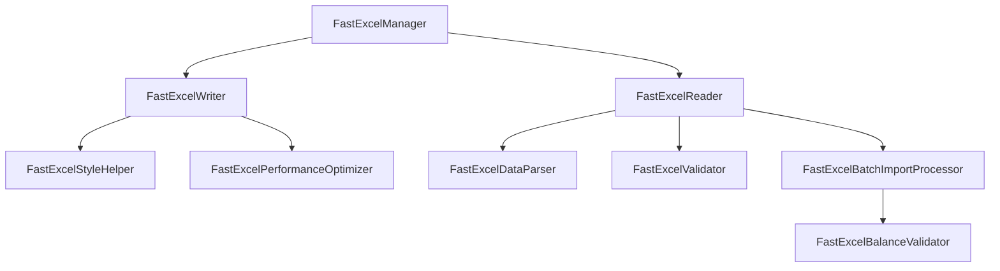

# FastExcel开发者文档

> 最后更新：2025-01-29  
> 版本：v2.0  
> 项目：CC小记 Excel功能

## 一、架构概述

### 1.1 模块结构
```
com.ccxiaoji.app.data.excel.fastexcel/
├── FastExcelManager.kt              # 主入口，管理导入导出
├── FastExcelWriter.kt               # Excel写入器
├── FastExcelReader.kt               # Excel读取器
├── FastExcelStyleHelper.kt          # 样式管理器
├── FastExcelDataParser.kt           # 数据解析器
├── FastExcelValidator.kt            # 数据验证器
├── FastExcelBatchImportProcessor.kt # 批量导入处理器
├── FastExcelBalanceValidator.kt     # 余额验证器
├── FastExcelPerformanceOptimizer.kt # 性能优化器
└── FastExcelBatchWriter.kt          # 批量写入器
```

### 1.2 依赖关系


## 二、核心组件详解

### 2.1 FastExcelManager - 主管理器

```kotlin
class FastExcelManager @Inject constructor(
    private val context: Context,
    private val ledgerApi: LedgerApi,
    private val todoApi: TodoApi,
    private val habitApi: HabitApi,
    private val scheduleApi: ScheduleApi,
    private val planApi: PlanApi
)
```

**主要功能**：
- 统一的导入导出入口
- 模块数据获取和保存
- 进度管理和错误处理

**关键方法**：
```kotlin
// 导出数据
suspend fun exportToExcel(
    uri: Uri,
    config: ExcelExportConfig,
    onProgress: (Float) -> Unit = {}
): ExportResult

// 导入数据
suspend fun importFromExcel(
    uri: Uri,
    config: ExcelImportConfig,
    onProgress: (ImportProgress) -> Unit = {}
): ImportResult
```

### 2.2 FastExcelWriter - 写入器

**核心功能**：
- 高性能Excel写入
- 支持多种数据类型
- 自动样式应用
- 内存优化

**使用示例**：
```kotlin
val writer = FastExcelWriter()

// 导出交易数据
writer.exportToExcel(
    outputStream = fileOutputStream,
    data = ExcelExportData(
        transactions = transactionList,
        metadata = ExportMetadata(
            exportDate = LocalDateTime.now(),
            appVersion = "2.0.0",
            totalAssets = 10000.0
        )
    ),
    onProgress = { progress ->
        updateUI("导出进度: ${progress * 100}%")
    }
)
```

**样式应用**：
```kotlin
// 自动应用的样式
- 标题行：蓝底白字，加粗
- 日期列：yyyy-MM-dd格式
- 金额列：千分位，2位小数
- 收入：绿色字体
- 支出：红色字体
```

### 2.3 FastExcelReader - 读取器

**核心功能**：
- 流式读取，低内存占用
- 自动类型识别
- 灵活的数据映射

**使用示例**：
```kotlin
val reader = FastExcelReader()

// 基础读取
val data = reader.readExcel(
    inputStream = fileInputStream,
    config = ImportConfig(
        hasHeader = true,
        dateFormats = listOf("yyyy-MM-dd", "yyyy/MM/dd")
    )
)

// 带过滤的读取
val filteredData = reader.readExcel(
    inputStream = fileInputStream,
    config = ImportConfig(
        rowFilter = { row -> row.rowNum > 0 && row.rowNum <= 1000 }
    )
)
```

### 2.4 FastExcelDataParser - 数据解析器

**支持的解析类型**：
- 交易数据（Transaction）
- 任务数据（Todo）
- 习惯数据（Habit）
- 排班数据（Schedule）
- 计划数据（Plan）

**解析示例**：
```kotlin
val parser = FastExcelDataParser()

// 解析交易数据
val transaction = parser.parseTransaction(rowData)
// 自动处理：日期格式、金额格式、类型转换

// 批量解析
val transactions = rowDataList.mapNotNull { row ->
    parser.parseTransaction(row)
}
```

### 2.5 FastExcelValidator - 数据验证器

**验证级别**：
- **错误（Error）**：阻塞导入，必须修正
- **警告（Warning）**：不阻塞，但建议修正

**验证示例**：
```kotlin
val validator = FastExcelValidator()

// 单条验证
val result = validator.validateTransaction(transaction)
when (result) {
    is ValidationResult.Valid -> // 继续处理
    is ValidationResult.Invalid -> // 显示错误
}

// 批量验证
val batchResult = validator.validateBatch(
    data = transactions,
    type = DataType.TRANSACTION
)
println("错误: ${batchResult.errorCount}, 警告: ${batchResult.warningCount}")
```

### 2.6 FastExcelPerformanceOptimizer - 性能优化器

**优化特性**：
- 对象池减少GC压力
- 智能缓存常用数据
- 动态批次大小调整
- 并行处理支持

**使用示例**：
```kotlin
val optimizer = FastExcelPerformanceOptimizer()

// 创建性能监控器
val monitor = optimizer.ExportPerformanceMonitor()
monitor.setTotalRows(100000)

// 使用对象池
val map = optimizer.borrowMap()
// 使用map...
optimizer.returnMap(map)

// 并行处理
val results = optimizer.processInParallel(
    data = largeDataList,
    parallelism = 4
) { item ->
    processItem(item)
}

// 生成性能报告
val report = optimizer.generatePerformanceReport(monitor)
```

## 三、高级特性

### 3.1 余额验证（记账专用）

```kotlin
val balanceValidator = FastExcelBalanceValidator()

val result = balanceValidator.validateTransactions(
    transactions = importedTransactions,
    accounts = accountMap,
    tolerance = 0.01 // 允许0.01的误差
)

// 处理验证结果
result.errors.forEach { error ->
    println("行${error.row}: ${error.message}")
    println("建议: ${error.suggestion}")
}
```

### 3.2 批量导入处理

```kotlin
val processor = FastExcelBatchImportProcessor(
    ledgerRepository = ledgerRepository,
    validator = validator
)

val result = processor.processTransactionBatch(
    data = excelData,
    config = BatchImportConfig(
        batchSize = 1000,
        validateBeforeImport = true,
        stopOnError = false,
        createMissingAccounts = true
    ),
    onProgress = { progress ->
        updateProgress(progress)
    },
    onError = { error ->
        logError(error)
    }
)
```

### 3.3 内存管理

```kotlin
// 大文件优化流
optimizer.createOptimizedExportFlow(
    data = millionRows,
    batchSize = 5000
).collect { batch ->
    // 分批处理，避免OOM
    processBatch(batch)
}
```

## 四、性能优化指南

### 4.1 导出优化

```kotlin
// ❌ 不推荐：一次性写入
workbook.write(allData) // 可能OOM

// ✅ 推荐：分批写入
data.chunked(5000).forEach { chunk ->
    writer.writeChunk(chunk)
    writer.flush() // 及时释放内存
}
```

### 4.2 导入优化

```kotlin
// ❌ 不推荐：全部加载到内存
val allRows = sheet.getAllRows()

// ✅ 推荐：流式处理
sheet.openStream().use { stream ->
    stream.forEach { row ->
        processRow(row)
    }
}
```

### 4.3 样式优化

```kotlin
// ❌ 不推荐：每个单元格创建新样式
cells.forEach { cell ->
    cell.style = createStyle() // 创建大量对象
}

// ✅ 推荐：复用样式对象
val style = createStyle()
cells.forEach { cell ->
    cell.style = style // 复用同一对象
}
```

## 五、错误处理

### 5.1 错误类型

```kotlin
sealed class ImportError {
    data class ValidationError(
        val row: Int,
        val column: String,
        val value: Any?,
        val message: String
    ) : ImportError()
    
    data class ParseError(
        val row: Int,
        val message: String,
        val cause: Throwable?
    ) : ImportError()
    
    data class BusinessError(
        val row: Int,
        val message: String,
        val suggestion: String
    ) : ImportError()
}
```

### 5.2 错误处理策略

```kotlin
// 1. 收集所有错误
val errorCollector = mutableListOf<ImportError>()

// 2. 分类处理
val criticalErrors = errorCollector.filter { it is ValidationError }
val warnings = errorCollector.filter { it is BusinessError }

// 3. 决策
if (criticalErrors.isNotEmpty()) {
    // 中止导入，显示错误
    showErrors(criticalErrors)
} else if (warnings.isNotEmpty()) {
    // 显示警告，让用户决定
    val proceed = showWarningsDialog(warnings)
    if (proceed) {
        continueImport()
    }
}
```

## 六、测试指南

### 6.1 单元测试

```kotlin
@Test
fun `test export performance`() {
    val writer = FastExcelWriter()
    val data = generateTestData(10000)
    
    val outputStream = ByteArrayOutputStream()
    val result = runBlocking {
        writer.exportToExcel(outputStream, data)
    }
    
    assertTrue(result.success)
    assertTrue(outputStream.size() > 0)
}
```

### 6.2 性能测试

```kotlin
@Test
fun `test large file handling`() {
    val monitor = PerformanceMonitor()
    val data = generateLargeDataset(100000)
    
    measureTimeMillis {
        exportLargeDataset(data, monitor)
    }.also { time ->
        val metrics = monitor.getMetrics()
        assertTrue(metrics.averageRowsPerSecond > 5000)
        assertTrue(metrics.memoryUsed < 100 * 1024 * 1024)
        println("导出10万行耗时: ${time}ms")
    }
}
```

## 七、迁移指南（从POI到FastExcel）

### 7.1 API对照表

| POI API | FastExcel API |
|---------|---------------|
| `new XSSFWorkbook()` | `Workbook(outputStream, "app", "1.0")` |
| `workbook.createSheet()` | `workbook.newWorksheet()` |
| `sheet.createRow()` | 直接使用 `sheet.value()` |
| `cell.setCellValue()` | `sheet.value(row, col, value)` |
| `cell.setCellStyle()` | `sheet.value(row, col, value, style)` |

### 7.2 注意事项

1. **只支持XLSX格式**，不支持XLS
2. **写入必须按行顺序**，不能随机访问
3. **不支持读取公式**，只能读取计算结果
4. **样式功能有限**，不支持复杂样式

## 八、最佳实践

### 8.1 代码规范

```kotlin
// 1. 使用依赖注入
@Singleton
class ExcelService @Inject constructor(
    private val manager: FastExcelManager
)

// 2. 使用协程处理异步
suspend fun exportData() = withContext(Dispatchers.IO) {
    // 导出逻辑
}

// 3. 资源自动管理
inputStream.use { stream ->
    // 处理流
}
```

### 8.2 性能建议

1. **批次大小**：根据数据特点调整，通常1000-5000
2. **内存限制**：设置合理的JVM堆大小
3. **并行度**：CPU核心数的1-2倍
4. **缓存策略**：预热常用数据

### 8.3 安全建议

1. **输入验证**：严格验证用户上传的文件
2. **大小限制**：限制文件大小，防止DoS
3. **权限控制**：检查用户导入导出权限
4. **数据脱敏**：导出时注意隐私数据

## 九、故障排查

### 9.1 常见问题

**Q: OutOfMemoryError**
```kotlin
// 解决方案
1. 减小批次大小
2. 增加JVM内存：-Xmx512m
3. 使用流式处理
4. 及时调用flush()
```

**Q: 导入速度慢**
```kotlin
// 解决方案
1. 使用批量操作代替单条插入
2. 关闭自动提交，手动控制事务
3. 使用并行处理
4. 优化数据库索引
```

### 9.2 调试技巧

```kotlin
// 启用详细日志
FastExcelManager.enableDebugLog = true

// 性能监控
val monitor = PerformanceMonitor()
// 处理数据...
println(monitor.generateReport())

// 内存分析
Runtime.getRuntime().apply {
    println("Used: ${totalMemory() - freeMemory()}")
    println("Max: $maxMemory")
}
```

## 十、版本兼容性

- **FastExcel**: 0.17.0+
- **Kotlin**: 1.9.0+
- **Android**: API 26+
- **协程**: 1.7.0+

---

更多技术支持，请联系开发团队。