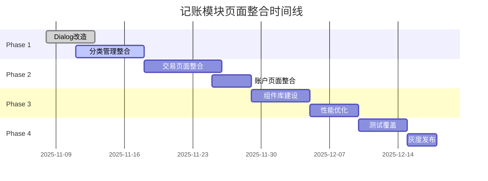

# 记账模块页面整合实施计划

> **制定时间**：2025-11-07
> **目标**：将记账模块55+个页面优化整合到45+个，减少代码冗余，提升用户体验
> **预计工期**：6-8周
> **优先级**：高

## 📊 执行进度跟踪

### 当前状态
- **启动时间**：待定
- **当前阶段**：规划完成，待执行
- **完成进度**：0/10 页面（0%）
- **最后更新**：2025-11-07

### 进度概览
| 阶段 | 状态 | 进度 | 开始时间 | 完成时间 | 备注 |
|------|------|------|----------|----------|------|
| **Phase 1** | ⏳ 待开始 | 0% | - | - | Dialog改造 + 分类整合 |
| **Phase 2** | ⏳ 待开始 | 0% | - | - | 交易 + 账户整合 |
| **Phase 3** | ⏳ 待开始 | 0% | - | - | 组件库 + 优化 |
| **Phase 4** | ⏳ 待开始 | 0% | - | - | 测试 + 发布 |

### 已完成任务
- [x] 制定详细实施计划（2025-11-07）
- [ ] 待开始实施...

### 当前阻塞
- 无

### 下一步行动
1. 开始Phase 1的Dialog改造
2. 创建DeleteConfirmDialog通用组件

## 一、整合目标与原则

### 核心目标
1. **减少页面数量**：从55+个减少到45+个（-20%）
2. **降低代码冗余**：消除3000+行重复代码
3. **提升用户体验**：减少导航层级，优化交互流程
4. **改善可维护性**：统一设计模式，提高代码复用率

### 设计原则
- ✅ **参数化设计**：通过参数区分新增/编辑模式
- ✅ **Dialog优先**：简单确认使用Dialog而非全屏页面
- ✅ **组件化拆分**：复杂页面拆分为独立组件
- ✅ **渐进式重构**：分阶段实施，确保稳定性
- ✅ **向后兼容**：保持API兼容，避免破坏性变更

## 二、整合清单（10个页面）

| 模块 | 当前页面 | 整合后 | 减少数量 | 优先级 |
|------|---------|---------|----------|--------|
| **分类管理** | AddCategoryScreen<br>EditCategoryScreen<br>FlatAddCategoryDialog<br>FlatEditCategoryDialog | CategoryEditorScreen | -3 | P0 |
| **交易管理** | AddTransactionScreen<br>EditTransactionScreen<br>DeleteTransactionScreen | TransactionEditorScreen<br>DeleteConfirmDialog | -2 | P0 |
| **账户管理** | AddAccountScreen<br>EditAccountScreen | AccountEditorScreen | -1 | P1 |
| **储蓄目标** | AddEditSavingsGoalScreen<br>DeleteGoalScreen | AddEditSavingsGoalScreen<br>DeleteConfirmDialog | -1 | P1 |
| **批量操作** | BatchDeleteScreen | BatchDeleteConfirmDialog | -1 | P2 |
| **预算管理** | AddEditBudgetScreen | （已优化） | 0 | - |
| **信用卡** | EditCreditCardScreen<br>CreditCardSettingsScreen | CreditCardEditorScreen | -1 | P2 |
| **定期交易** | AddEditRecurringTransactionScreen | （已优化） | 0 | - |
| **导入导出** | LedgerImportScreen<br>QianjiImportScreen | ImportScreen（统一入口） | -1 | P3 |
| **总计** | 20个页面 | 10个页面 | **-10** | - |

## 三、实施阶段规划

### 🚀 Phase 1：快速见效（第1-2周）
**目标**：快速减少5个页面，改善用户体验

#### 1.1 Dialog改造（第1周）
**工作量**：3人天
**状态**：⏳ 待开始

**任务清单**：
```
□ DeleteTransactionScreen → DeleteTransactionConfirmDialog 【未开始】
  - 创建通用DeleteConfirmDialog组件
  - 迁移删除逻辑到ViewModel
  - 更新导航调用为showDialog
  文件位置：screen/transaction/delete/DeleteTransactionScreen.kt

□ DeleteGoalScreen → DeleteGoalConfirmDialog 【未开始】
  - 复用DeleteConfirmDialog组件
  - 适配储蓄目标删除逻辑
  文件位置：screen/savings/DeleteGoalScreen.kt

□ BatchDeleteScreen → BatchDeleteConfirmDialog 【未开始】
  - 适配批量删除场景
  - 添加批量信息展示
  文件位置：screen/batch/BatchDeleteScreen.kt
```

**技术实现**：
```kotlin
// 通用删除确认Dialog
@Composable
fun DeleteConfirmDialog(
    title: String,
    message: String,
    itemCount: Int = 1,
    onConfirm: () -> Unit,
    onDismiss: () -> Unit
) {
    AlertDialog(
        onDismissRequest = onDismiss,
        title = { Text(title) },
        text = {
            Text(
                if (itemCount > 1) {
                    "确定要删除这 $itemCount 条记录吗？"
                } else {
                    message
                }
            )
        },
        confirmButton = {
            TextButton(onClick = onConfirm) {
                Text("删除", color = MaterialTheme.colorScheme.error)
            }
        },
        dismissButton = {
            TextButton(onClick = onDismiss) {
                Text("取消")
            }
        }
    )
}
```

#### 1.2 分类管理整合（第1-2周）
**工作量**：5人天

**任务清单**：
```
□ 创建CategoryEditorScreen
  - 设计参数化接口（categoryId: String? = null）
  - 整合新增/编辑逻辑
  - 统一UI布局

□ 删除冗余页面
  - 移除FlatAddCategoryDialog
  - 移除FlatEditCategoryDialog
  - 清理相关引用

□ 更新CategoryViewModel
  - 合并add/edit逻辑
  - 优化状态管理
```

**风险点**：
- ⚠️ 分类选择器依赖需要同步更新
- ⚠️ 二级分类逻辑需要充分测试

### 🔧 Phase 2：核心整合（第3-4周）
**目标**：完成交易和账户页面整合

#### 2.1 交易页面整合（第3周）
**工作量**：8人天

**任务清单**：
```
□ 拆分AddTransactionScreen组件
  - TransactionTypeSelector（收支类型选择）
  - CategoryGridSection（分类网格）
  - AccountSelectorSection（账户选择）
  - AmountInputSection（金额输入）
  - NumberKeypadSection（数字键盘）
  - DateTimePickerSection（日期时间）
  - NoteInputSection（备注输入）

□ 创建TransactionEditorScreen
  - 整合新增/编辑模式
  - 使用拆分后的组件
  - 优化状态管理

□ 重构TransactionViewModel
  - 抽取公共逻辑
  - 优化数据加载流程
```

**代码架构**：
```kotlin
@Composable
fun TransactionEditorScreen(
    transactionId: String? = null,  // null = 新增模式
    onNavigateBack: () -> Unit,
    viewModel: TransactionEditorViewModel = hiltViewModel()
) {
    val uiState by viewModel.uiState.collectAsState()

    LaunchedEffect(transactionId) {
        transactionId?.let {
            viewModel.loadTransaction(it)
        }
    }

    Column {
        // 顶部栏
        TransactionEditorTopBar(
            isEditMode = transactionId != null,
            onBack = onNavigateBack,
            onSave = { viewModel.save() }
        )

        // 使用拆分后的组件
        TransactionTypeSelector(
            selected = uiState.type,
            onSelect = viewModel::updateType
        )

        CategoryGridSection(
            categories = uiState.categories,
            selected = uiState.selectedCategory,
            onSelect = viewModel::selectCategory
        )

        // ... 其他组件
    }
}
```

#### 2.2 账户页面整合（第4周）
**工作量**：4人天

**任务清单**：
```
□ 创建AccountEditorScreen
  - 整合AddAccountScreen和EditAccountScreen
  - 统一表单验证逻辑
  - 优化图标选择器

□ 更新AccountViewModel
  - 参数化处理新增/编辑
  - 统一保存逻辑
```

### 🎯 Phase 3：深度优化（第5-6周）
**目标**：组件化改造和性能优化

#### 3.1 组件库建设（第5周）
**工作量**：6人天

**任务清单**：
```
□ 提取通用组件
  - EntityEditorScaffold（编辑页面框架）
  - FormFieldSection（表单字段区域）
  - IconPickerDialog（图标选择器）
  - ColorPickerDialog（颜色选择器）
  - AmountKeyboard（金额键盘）

□ 创建组件文档
  - 组件使用示例
  - 参数说明
  - 最佳实践
```

**组件示例**：
```kotlin
// 通用编辑页面框架
@Composable
fun EntityEditorScaffold(
    title: String,
    isEditMode: Boolean,
    onBack: () -> Unit,
    onSave: () -> Unit,
    isSaving: Boolean = false,
    content: @Composable ColumnScope.() -> Unit
) {
    Scaffold(
        topBar = {
            TopAppBar(
                title = { Text(title) },
                navigationIcon = {
                    IconButton(onClick = onBack) {
                        Icon(Icons.Default.ArrowBack, "返回")
                    }
                },
                actions = {
                    TextButton(
                        onClick = onSave,
                        enabled = !isSaving
                    ) {
                        if (isSaving) {
                            CircularProgressIndicator(modifier = Modifier.size(16.dp))
                        } else {
                            Text(if (isEditMode) "更新" else "保存")
                        }
                    }
                }
            )
        }
    ) { paddingValues ->
        Column(
            modifier = Modifier
                .padding(paddingValues)
                .fillMaxSize()
        ) {
            content()
        }
    }
}
```

#### 3.2 性能优化（第6周）
**工作量**：5人天

**任务清单**：
```
□ 优化状态管理
  - 减少不必要的重组
  - 使用remember和derivedStateOf
  - 优化列表性能

□ 代码清理
  - 删除未使用的代码
  - 统一命名规范
  - 优化导入语句
```

### 📊 Phase 4：测试与发布（第7-8周）
**目标**：确保质量，平稳上线

#### 4.1 测试覆盖（第7周）
**工作量**：5人天

**测试清单**：
```
□ 单元测试
  - ViewModel测试（80%覆盖率）
  - UseCase测试（90%覆盖率）
  - Repository测试（70%覆盖率）

□ 集成测试
  - 导航流程测试
  - 数据流测试
  - 权限处理测试

□ UI测试
  - 关键用户流程
  - 边界情况处理
  - 横竖屏适配
```

#### 4.2 灰度发布（第8周）
**工作量**：3人天

**发布策略**：
```
1. 内部测试（第1天）
   - 开发团队全功能测试
   - 修复紧急问题

2. Beta测试（第2-5天）
   - 10%用户灰度
   - 收集反馈
   - 性能监控

3. 全量发布（第6-7天）
   - 100%用户推送
   - 监控崩溃率
   - 准备热修复
```

## 四、风险管理

### 主要风险及应对

| 风险 | 影响 | 概率 | 应对措施 |
|------|------|------|----------|
| 破坏现有功能 | 高 | 中 | 完整的测试覆盖，灰度发布 |
| 用户不适应新界面 | 中 | 低 | 提供新手引导，收集反馈快速迭代 |
| 性能下降 | 高 | 低 | 性能测试，Profile分析 |
| 进度延期 | 中 | 中 | 分阶段实施，核心功能优先 |
| 数据迁移问题 | 高 | 低 | 充分测试，提供回滚方案 |

### 回滚计划
```
1. 代码层面
   - Git分支管理，每个阶段独立分支
   - 保留原页面代码，通过Feature Flag切换

2. 发布层面
   - 保留上一版本APK
   - 服务端配置开关
   - 紧急热修复通道

3. 数据层面
   - 数据库版本兼容
   - 导出/导入功能验证
```

## 五、资源需求

### 人力资源
- **主程序员**：1人（全程参与）
- **测试工程师**：1人（Phase 4参与）
- **UI设计师**：0.5人（按需支持）
- **总计**：约45人天

### 技术资源
- Android Studio最新版
- 测试设备（不同Android版本）
- 性能分析工具
- 崩溃监控平台

## 六、成功指标

### 量化指标
- ✅ 页面数量减少18%（55→45）
- ✅ 代码行数减少3000+行
- ✅ 启动速度提升10%
- ✅ 内存占用减少15%
- ✅ 崩溃率 < 0.1%

### 质量指标
- ✅ 测试覆盖率 > 60%
- ✅ 代码复用率提升20%
- ✅ 用户满意度 > 4.5分
- ✅ 开发效率提升25%

## 七、关键里程碑



## 八、检查清单

### Phase 1 完成标准
- [ ] 3个全屏确认页面改为Dialog
- [ ] 分类管理4个页面合并为1个
- [ ] 所有测试通过
- [ ] 代码review完成

### Phase 2 完成标准
- [ ] 交易页面组件化拆分完成
- [ ] Add/Edit页面合并完成
- [ ] ViewModel重构完成
- [ ] 性能无明显下降

### Phase 3 完成标准
- [ ] 通用组件库建立
- [ ] 组件文档完善
- [ ] 代码整理完成
- [ ] 性能优化达标

### Phase 4 完成标准
- [ ] 测试覆盖率达标
- [ ] Beta测试反馈处理
- [ ] 全量发布成功
- [ ] 监控指标正常

## 九、后续规划

### 短期优化（1-2月）
- 继续优化剩余页面
- 完善组件库
- 提升测试覆盖率

### 中期规划（3-6月）
- 引入设计系统
- 模块化架构优化
- 性能持续优化

### 长期愿景（6-12月）
- AI智能记账
- 跨平台支持
- 云端同步优化

## 十、详细任务跟踪表

### 页面整合进度明细

| 序号 | 原页面 | 目标形式 | 文件路径 | 状态 | 完成日期 | 备注 |
|------|--------|----------|----------|------|----------|------|
| **分类管理（-3）** |
| 1 | AddCategoryScreen | CategoryEditorScreen | `screen/category/AddCategoryScreen.kt` | ⏳ 待开始 | - | 298行 |
| 2 | EditCategoryScreen | ↑ 合并到上方 | `screen/category/EditCategoryScreen.kt` | ⏳ 待开始 | - | 304行 |
| 3 | FlatAddCategoryDialog | 删除 | `screen/category/FlatAddCategoryDialog.kt` | ⏳ 待开始 | - | 未使用 |
| 4 | FlatEditCategoryDialog | 删除 | `screen/category/FlatEditCategoryDialog.kt` | ⏳ 待开始 | - | 未使用 |
| **交易管理（-2）** |
| 5 | AddTransactionScreen | TransactionEditorScreen | `screen/transaction/AddTransactionScreen.kt` | ⏳ 待开始 | - | 1895行！|
| 6 | EditTransactionScreen | ↑ 合并到上方 | `screen/transaction/EditTransactionScreen.kt` | ⏳ 待开始 | - | 重复代码 |
| 7 | DeleteTransactionScreen | DeleteConfirmDialog | `screen/transaction/delete/DeleteTransactionScreen.kt` | ⏳ 待开始 | - | 改Dialog |
| **账户管理（-1）** |
| 8 | AddAccountScreen | AccountEditorScreen | `screen/account/AddAccountScreen.kt` | ⏳ 待开始 | - | 240行 |
| 9 | EditAccountScreen | ↑ 合并到上方 | `screen/account/EditAccountScreen.kt` | ⏳ 待开始 | - | 161行 |
| **其他（-2）** |
| 10 | DeleteGoalScreen | DeleteConfirmDialog | `screen/savings/DeleteGoalScreen.kt` | ⏳ 待开始 | - | 157行 |
| 11 | BatchDeleteScreen | BatchDeleteConfirmDialog | `screen/batch/BatchDeleteScreen.kt` | ⏳ 待开始 | - | 144行 |

### 状态图例
- ⏳ **待开始**：计划中，未动工
- 🚧 **进行中**：正在开发
- ✅ **已完成**：开发完成并测试通过
- ❌ **已取消**：计划变更，不再执行
- 🔄 **需重做**：完成后发现问题需要返工

---

**文档维护者**：Claude Code
**最后更新**：2025-11-07
**下次评审**：Phase 1完成后（预计2025-11-18）