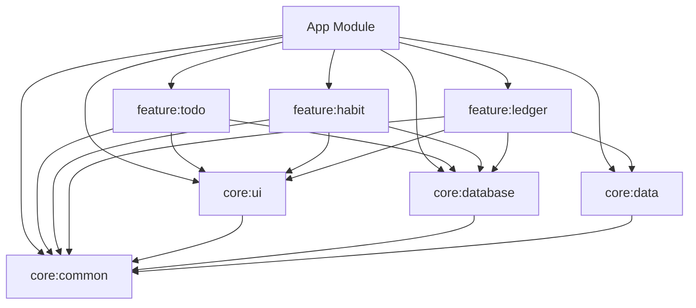

# CC小记模块依赖分析报告

## 当前模块结构

```
CcXiaoJi/
├── app/                    # 应用主模块 (依赖所有模块)
├── core/                   # 核心基础设施模块
│   ├── common/            # 基础工具类和扩展
│   ├── ui/                # 通用UI组件和主题
│   ├── database/          # Room数据库和DAO
│   └── data/              # 共享数据层基础设施
└── feature/               # 功能模块
    ├── todo/              # 待办事项模块
    ├── habit/             # 习惯追踪模块
    └── ledger/            # 记账模块

```

## 依赖关系图



## 依赖问题分析

### 1. 重复依赖
所有模块都重复依赖了以下库：
- Compose BOM 和相关库
- Hilt 和 KSP
- Coroutines 和 DateTime
- Gson

### 2. 不必要的直接依赖
- Feature 模块直接依赖了 `core:database`，违反了架构原则
- 应该通过 Repository 模式访问数据库

### 3. 编译性能影响
- 每个模块都完整配置了 Compose，增加了编译时间
- 重复的依赖声明导致依赖解析时间增加

## 优化建议

### 1. 创建依赖管理插件
- 统一管理通用依赖
- 减少重复配置

### 2. 优化模块依赖
- Feature 模块不应直接依赖 database 模块
- 通过 API 接口访问数据

### 3. 实施懒加载
- 按需加载 Feature 模块
- 减少启动时间

### 4. 构建缓存优化
- 配置 Gradle 构建缓存
- 优化增量编译

## 性能基准

### 当前状态
- 全量编译时间：约 3-5 分钟
- 增量编译时间：约 30-60 秒
- APK 大小：约 15-20 MB

### 优化目标
- 全量编译时间：< 3 分钟
- 增量编译时间：< 30 秒
- APK 大小：< 15 MB